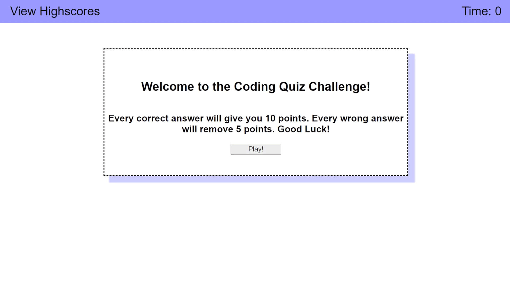

# 04 Web APIs: Code Quiz

This app will test your knowledge of Javascript. When you click start button, the challenge will begin. There is a timer that will count down from sixty seconds. For every selected answer that is wrong the time is subtracted by ten seconds and a penalty of five points to your total score. There are a total of ten questions, once you are done or the timer gets to zero, you will be given your total score. You are given the opportunity to save your score with your initials. Once you save you will be taken to the scoreboard where your scores will kept in the local storage. You can also clear the list which will delete all the scores in the scoreboard forever. You can also access the scoreboard on the top left in the start screen.

## Getting Started

[Click Here To Visit The Page](https://icortes.github.io/code-quiz/)

### Prerequisites
* Must have a web browser.
### Installing
* No installation required.

### Mock-Up
The following animation demonstrates the app functionality:

### Code Snippet
The following code is commented line by line and handles the deletion of the scoreboard:

    //get highscore list
    var hsListEl = document.getElementById("hs-list");
    //get go back button element
    var goBack = document.getElementById("go-back");
    //get clear highscores element
    var clearBtn = document.getElementById("clear-hs");

    //function to show highscores
    function showHighScores() {
        //clear hsListEl
        hsListEl.innerHTML = "";
        //get list of users from local storage
        var users = JSON.parse(localStorage.getItem("users"));
        //if users has content inside
        if (users !== null) {
            //for loop to append items in users to hs-list
            for (var i = 0; i < users.length; i++) {
                //grab item in users by index of loop
                var item = users[i];
                console.log(item);
                //create li element
                var li = document.createElement("li");
                //add text to li element
                li.textContent = item.init + " scored " + item.scr;
                console.log(li);
                //append li to hsListEl
                hsListEl.appendChild(li);
            }
        }
        //if users doesn't have items exit function
        else {
            return;
        }
    }

    showHighScores();

    //add click event listener to go back button
    goBack.addEventListener("click", function () {
        //goes back to previous page
        window.history.back();
    });

    //add click event on clear highscores to delete them
    clearBtn.addEventListener("click", function () {
        console.log(hsListEl);
        //check if hsListEl has items, if it does continue to delete
        if (hsListEl !== null) {
            //while loop to delete all items
            while (hsListEl.lastElementChild) {
                //delete all children
                hsListEl.removeChild(hsListEl.lastElementChild);
            }
            //deletes the users key from local storage and erases highscores
            localStorage.removeItem("users");
        }
        //if no items then exit function
        else {
            return;
        }
    });

## Built With

* [HTML](https://developer.mozilla.org/en-US/docs/Web/HTML)
* [CSS](https://developer.mozilla.org/en-US/docs/Web/CSS)
* [Javascript](https://developer.mozilla.org/en-US/docs/Web/JavaScript)

## Deployed Link

* [See Live Site](https://icortes.github.io/code-quiz/)

## Authors

* **Isaac Cortes Hernandez** 

- [Link to Portfolio Site](https://icortes.github.io/my-first-portfolio/)
- [Link to Github](https://github.com/icortes)
- [Link to LinkedIn](https://www.linkedin.com/in/cortes-isaac)

## License

This project is licensed under the MIT License 

## Acknowledgments

* w3schools.com
* developer.mozilla.org
* css-tricks.com
